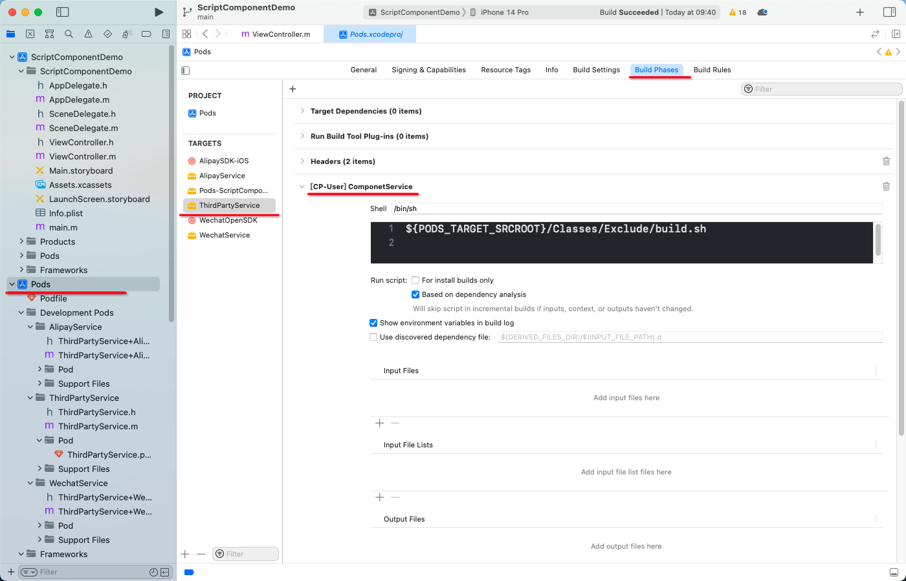

# ScriptComponentDemo
此项目是一个模块自动拼装示例，通过[脚本(/ThirdPartyService/Classes/Exclude/build.sh)](/ThirdPartyService/Classes/Exclude/build.sh)把类似插件的子模块，自动引入到特定的头文件中，并把头文件放到 Pods/Headers/Public 目录下，方便直接引入。  
脚本的逻辑是找到含有“//  @ThirdPartyService”的头文件，然后生成 Pods/Headers/Public/ThirdPartyProtocol.h 文件，每次编译就会自动生成。
脚本依赖 cocoapods 的 script_phase 特性，具体可查看：[ThirdPartyService.podspec](/ThirdPartyService/ThirdPartyService.podspec)中的 spec.script_phase 属性

## 如何测试
1. 下载项目
2. 运行 pod install
3. 编译，即可查看到 Pods/Headers/Public/ThirdPartyProtocol.h 文件，在项目中 import 时会有提示

pod项目下的门道：

